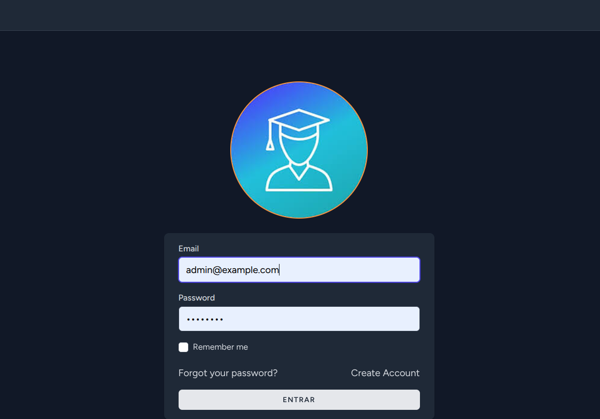
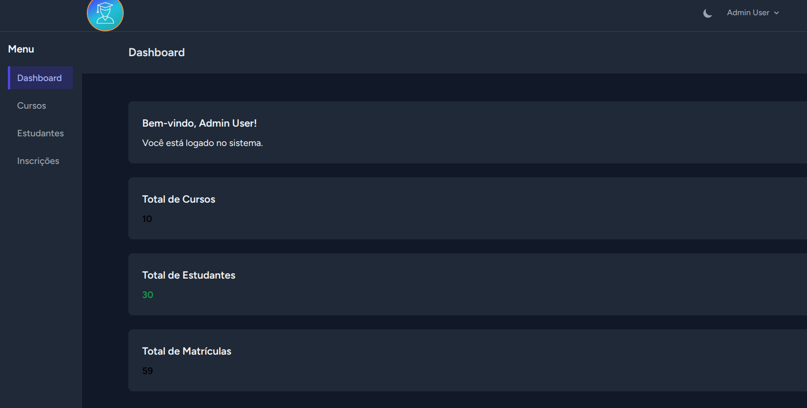
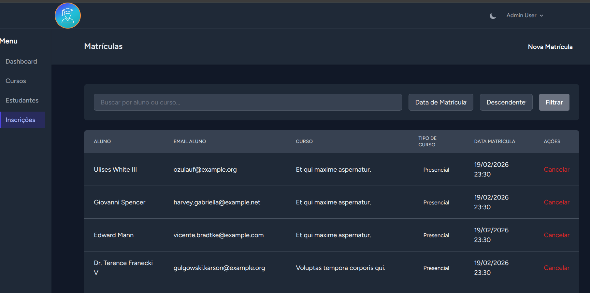
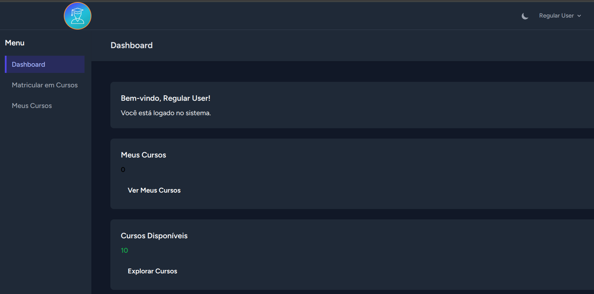
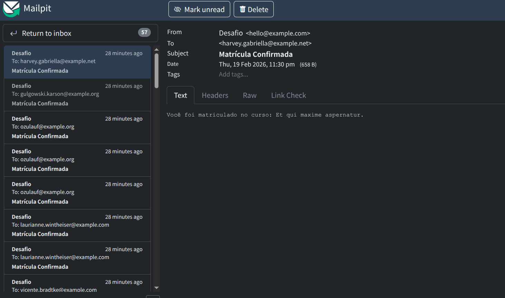

<p align="center"><a href="https://laravel.com" target="_blank"></a></p>

<p align="center"><a href="https://github.com/lucenarenato" target="_blank"></a></p>

<p align="center"><a href="https://github.com/lucenarenato" target="_blank"></a></p>

<p align="center"><a href="https://github.com/lucenarenato" target="_blank"></a></p>

<p align="center"><a href="https://github.com/lucenarenato" target="_blank"></a></p>

<p align="center"><a href="https://github.com/lucenarenato" target="_blank"></a></p>

### Instalação

1. **Clone o repositório**
```bash
git clone https://github.com/lucenarenato/desafio-matrcula-de-alunos.git
cd desafio-matrcula-de-alunos
```

2. **Copie o arquivo .env**
```bash
cp .env.example .env
```

3. **Levante os containers Docker**
```bash
./vendor/bin/sail up -d
```

4. **Execute as migrations e seeds**
```bash
./vendor/bin/sail artisan migrate:fresh --seed
```

5. **Acesse a aplicação**
- URL: http://localhost
- Realize o login

### Credenciais de Teste

**Usuário Admin:**
- Email: `admin@example.com`
- Senha: `password`

**Usuário Normal:**
- Email: `user@example.com`
- Senha: `password`

## Email:
- URL: http://localhost:8025/

## 🚀 Executar os Testes

### Executar todos os testes
```bash
./vendor/bin/sail artisan test
```

### Executar com relatório detalhado
```bash
./vendor/bin/sail artisan test --testdox
```

### Executar testes de um arquivo específico
```bash
./vendor/bin/sail artisan test tests/Feature/CursoControllerTest.php
```

### Executar um teste específico
```bash
./vendor/bin/sail artisan test --filter test_criar_curso
```

### Gerar relatório de cobertura
```bash
./vendor/bin/sail artisan test --coverage

## About 

# 🎓 Sistema de Matrícula - Guia Rápido de Início

## 🚀 Iniciar em 3 Passos

### 1️⃣ Levante os containers Docker
```bash
./vendor/bin/sail up -d
```

### 2️⃣ Execute as migrations e seeds
```bash
./vendor/bin/sail artisan migrate:fresh --seed
```

### 3️⃣ Abra no navegador
```
http://localhost
```

---

## 📝 Credenciais de Acesso

| Tipo | Email | Senha |
|------|-------|-------|
| **Admin** | admin@example.com | password |
| **User** | user@example.com | password |

> Faça login como **admin** para acessar o painel administrativo

## 🛠️ Comandos Úteis

```bash
# Ver logs em tempo real
./vendor/bin/sail logs -f

# Acessar shell do container
./vendor/bin/sail shell

# Parar containers
./vendor/bin/sail down

# Limpar cache
./vendor/bin/sail artisan cache:clear

# Resetar banco (cuidado!)
./vendor/bin/sail artisan migrate:fresh --seed

# Rodar apenas seeds
./vendor/bin/sail artisan db:seed

# Verificar integridade do projeto
./verify.sh
```

app/
├── Repositories/     
├── Services/         
├── Managers/         
├── Adapters/         
├── Observers/        
└── Providers/        

# Todos os testes
./vendor/bin/sail artisan test

# Com relatório detalhado
./vendor/bin/sail artisan test --testdox

# Específico
./vendor/bin/sail artisan test tests/Feature/AuthenticationTest.php
